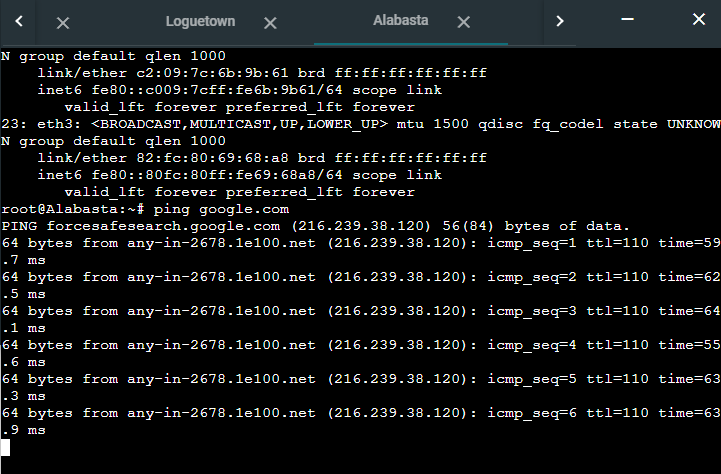

# Jarkom-Modul-3-E08-2021

Lapres Praktikum Jaringan Komputer Modul 3
- Fais Rafii Akbar Hidiya (05111940000026)
- Zahra Dyah Meilani (05111940000069)
- Aji Rindra Fakhrezi Putra Faisal (05111940000205)

## **Soal 1**

Luffy yang sudah menjadi Raja Bajak Laut ingin mengembangkan daerah kekuasaannya dengan membuat peta seperti berikut:


Luffy bersama Zoro berencana membuat peta tersebut dengan kriteria EniesLobby sebagai DNS Server, Jipangu sebagai DHCP Server, Water7 sebagai Proxy Server.

### **Pembahasan**

Pertama, kita buat terlebih dahulu topologi sesuai gambar pada soal. Kemudian edit network configuration di setiap node menjadi sebagai berikut:

- Foosha

```
auto eth0
iface eth0 inet dhcp

auto eth1
iface eth1 inet static
	address 10.33.1.1
	netmask 255.255.255.0

auto eth2
iface eth2 inet static
	address 10.33.2.1
	netmask 255.255.255.0

auto eth3
iface eth3 inet static
	address 10.33.3.1
	netmask 255.255.255.0
```

- Jipangu

```
auto eth0
iface eth0 inet static
	address 10.33.2.4
	netmask 255.255.255.0
	gateway 10.33.2.1
```

- EniesLobby
  
```
auto eth0
iface eth0 inet static
	address 10.33.2.2
	netmask 255.255.255.0
	gateway 10.33.2.1
```

- Water7

```
auto eth0
iface eth0 inet static
	address 10.33.2.3
	netmask 255.255.255.0
	gateway 10.33.2.1
```

- Loguetown

```
auto eth0
iface eth0 inet static
	address 10.33.1.2
	netmask 255.255.255.0
	gateway 10.33.1.1
```

- Alabasta

```
auto eth0
iface eth0 inet static
	address 10.33.1.3
	netmask 255.255.255.0
	gateway 10.33.1.1
```

- Skypie

```
auto eth0
iface eth0 inet static
	address 10.33.3.2
	netmask 255.255.255.0
	gateway 10.33.3.1
```

- Tottoland

```
auto eth0
iface eth0 inet static
	address 10.33.3.3
	netmask 255.255.255.0
	gateway 10.33.3.1
```

Setelah itu, kita buat node supaya dapat tersambung ke internet dengan menjalankan perintah di bawah pada Foosha:

`iptables -t nat -A POSTROUTING -o eth0 -j MASQUERADE -s 10.33.0.0/16`

Kemudian pada node lainnya:

`echo nameserver 192.168.122.1 > /etc/resolv.conf`

## **Soal 2**

..., dan Foosha sebagai DHCP Relay.

### **Pembahasan**

Pertama, install DHCP relay pada Foosha:

```
apt-get update
apt-get install isc-dhcp-relay -y
```

Edit isi `/etc/default/isc-dhcp-relay` dengan menggunakan nano menjadi seperti berikut:


ubah nilai SERVERS dengan IP Jipangu (DHCP server) yaitu "10.33.2.4" supaya terhubung dengan DHCP server dan INTERFACES nya menjadi "eth1 eth2 eth3" supaya terhubung dengan switch1, switch2, dan switch3.

Selanjutnya, pada Jipangu yang merupakan DHCP Server kita lakukan beberapa hal:

Pertama, install DHCP server:

```
apt-get update
apt-get install isc-dhcp-server -y
```

Edit isi `/etc/default/isc-dhcp-server` dengan menggunakan nano menjadi seperti berikut:


ubah nilai INTERFACES nya menjadi "eth0" karena pada Jipangu yang digunakan adalah eth0.

Edit isi `/etc/sysctl.conf` dengan menggunakan nano menjadi seperti berikut:


dan uncomment `net.ipv4.ip_forward=1`.

Pada EniesLobby, install bind9: 

```
apt-get update
apt-get install bind9 -y
```

Dan pada Water7, install squid dan apache:

```
apt-get update
apt-get install squid -y
apt-get install apache2-utils -y
```
Start DHCP server pada Jipangu dan DHCP relay pada Foosha:

```
service isc-dhcp-server restart
service isc-dhcp-relay restart
```

Untuk mengecek status:

```service isc-dhcp-server status```

## **Soal 3**

Ada beberapa kriteria yang ingin dibuat oleh Luffy dan Zoro, yaitu:

### **Pembahasan**
  
1. Semua client yang ada HARUS menggunakan konfigurasi IP dari DHCP Server.

    Agar semua client menggunakan konfigurasi IP dari DHCP Server, maka edit network configuration menjadi sebagai berikut:

    ```
    auto eth0
    iface eth0 inet dhcp
    ```

2. Client yang melalui Switch1 mendapatkan range IP dari [prefix IP].1.20 - [prefix IP].1.99 dan [prefix IP].1.150 - [prefix IP].1.169.
   
   Pada node Jipangu buka file `/etc/dhcp/dhcpd.conf`, dan tambahkan:

   ```
   subnet 10.33.2.0 netmask 255.255.255.0 {
    option routers 10.33.2.1;
    }
   ```
   supaya DHCP relay (Foosha) dapat terhubung dengan subnet 10.33.2.0.

   Kemudian tambahkan pula:

   ```
   subnet 10.33.1.0 netmask 255.255.255.0 {
    range 10.33.1.20 10.33.1.99;
    range 10.33.1.150 10.33.1.169;
    option routers 10.33.1.1;
    option broadcast-address 10.33.1.255;
    option domain-name-servers 10.33.2.2;
    default-lease-time 360;
    max-lease-time 7200;
    }
    ```

    

    Periksa pada client node switch 3 dengan `ip a`,

    - Loguetown

      

    - Alabasta

      

    Dari hasil tersebut, nilai IP kedua node telah sesuai dengan range di soal.

## **Soal 4**

Client yang melalui Switch3 mendapatkan range IP dari [prefix IP].3.30 - [prefix IP].3.50.

### **Pembahasan**

Pada node Jipangu buka file `/etc/dhcp/dhcpd.conf`, dan tambahkan:

```
subnet 10.33.3.0 netmask 255.255.255.0 {
  range 10.33.3.30 10.33.3.50;
  option subnet-mask 255.255.255.0;
  option broadcast-address 10.33.3.255;
  option domain-name-servers 10.33.2.2;
  option routers 10.33.3.1;
  default-lease-time 720;
  max-lease-time 7200;
}
```


Periksa pada client node switch 3 dengan `ip a`,

- Skypie


- Tottoland


Dari hasil tersebut, nilai IP kedua node telah sesuai dengan range di soal.

## **Soal 5**

Client mendapatkan DNS dari EniesLobby dan client dapat terhubung dengan internet melalui DNS tersebut.

### **Pembahasan**

Pada Jipangu, tambahkan  `option domain-name-servers 10.33.2.2;` di konfigurasi dhcpd.conf.

Pada EniesLobby, buka file `/etc/bind/named.conf.options`, tambahkan:

```
forwarders {
  192.168.122.1;
};
```

Kemudian comment pada bagian:

`dnssec-validation auto;`

Dan tambahkan:

`allow-query{any;};`


Lalu, restart bind9:

`service bind9 restart`

Tes koneksi internet di setiap node

- Loguetown

    

- Alabasta

    

- Skypie

    

- Tottoland

    


## **Soal 6**
Lama waktu DHCP server meminjamkan alamat IP kepada Client yang melalui Switch1 selama 6 menit sedangkan pada client yang melalui Switch3 selama 12 menit. Dengan waktu maksimal yang dialokasikan untuk peminjaman alamat IP selama 120 menit.

### **Pembahasan**

Pada subnet switch pertama, digunakan default lease time 360 dan max lease time 7200.
```
default-lease-time 360;
max-lease-time 7200;
```

Pada subnet switch ketiga, digunakan default lease time 720 dan max lease time 7200.

```
default-lease-time 720;
max-lease-time 7200;
```


## **Soal 7**

Luffy dan Zoro berencana menjadikan Skypie sebagai server untuk jual beli kapal yang dimilikinya dengan alamat IP yang tetap dengan IP [prefix IP].3.69

### **Pembahasan**

Agar node Skypie memiliki alamat IP tetap, maka digunakan fixed address.

Pertama, periksa ethernet pada Skypie dengan command `ip a`, ambil nilai link/ether:


Pada node Jipangu buka file `/etc/dhcp/dhcpd.conf`, dan tambahkan:

```
host Skypie {
    hardware ethernet da:92:b0:a5:84:6c;
    fixed-address 10.33.3.69;
}
```

hardware ethernet merupakan nilai link/ether dari Skypie, yaitu da:92:b0:a5:84:6c dan fixed-address merupakan IP yang diminta, yaitu 10.33.3.69.

Edit network configuration pada Skypie:

```
auto eth0
iface eth0 inet dhcp
hwaddress ether da:92:b0:a5:84:6c
```


Restart DHCP server pada Jipangu:

```service isc-dhcp-server restart```

Hasil `ip a` di node Skypie:


IP Skypie telah berubah menjadi 10.33.3.69.


## **Soal 8**

Loguetown digunakan sebagai client Proxy agar transaksi jual beli dapat terjamin keamanannya, juga untuk mencegah kebocoran data transaksi. Pada Loguetown, proxy harus bisa diakses dengan nama jualbelikapal.yyy.com dengan port yang digunakan adalah 5000.


### **Pembahasan**

Sebelum membuat proxy pada Water7, diharuskan membuat DNS untuk jualbelikapal.yyy.com di EniesLobby. Membuat DNS tersebut diawali dengan konfigurasi pada file `/etc/bind/named.conf.local` dan tambahkan isi file tersebut sebagai berikut :


dan buat file konfigurasi dns server dengan nama `jualbelikapal.E08.com` di directory `/etc/bind` dan isi file sebagai berikut :


dan start DNS tersebut dengan `service bind9 restart`.

Check pada client apakah dns tersebut bisa di ping : 


Setelah DNS sudah dibuat, membuat proxy server dengan squid pada Water7 yang diawali dengan beberapa command berikut :

```
apt-get update
apt-get install squid -y
```

Setelah itu buat konfigurasi squid di directory `/etc/squid` dan buat file `squid.conf` dan isi file sebagai berikut :

```
http port 5000
visible_hostname jualbelikapal.E08.com

http_access allow all
```

Setelah itu untuk start proxy gunakan command `squid service restart`. Untuk check apakah proxy berhasil atau tidak, digunakan Loguetown untuk menggunakan proxy server yang telah dibuat dengan cara melakukan command :

`export http_proxy="http://10.33.2.3:5000"` dan `export http_proxy="http://jualbelikapal.E08.com:5000"`.

Check apakah sudah tersambung dengan proxy dengan menggunakan command `env | grep -i proxy` :


ping jualbelikapal.E08.com : 


Dan gunakan command `lynx its.ac.id` :


## **Soal 9**

Agar transaksi jual beli lebih aman dan pengguna website ada dua orang, proxy dipasang autentikasi user proxy dengan enkripsi MD5 dengan dua username, yaitu luffybelikapalyyy dengan password luffy_yyy dan zorobelikapalyyy dengan password zoro_yyy.

### **Pembahasan**

Untuk membuat user dan password untuk proxy pertama-tama install apache2-utils dengan menggunakan command :

`sudo apt-get install apache2-utils -y`

Setelah itu gunakan command `htpasswd -cm /etc/squid/passwd USERNAME` untuk create new file dengan enkripsi MD5 dan `htpasswd -m /etc/squid/passwd USERNAME` untuk membuat user baru di file tersebut. Command untuk kedua user baru tersebut adalah :

```
htpasswd -cm /etc/squid/passwd luffybelikapalE08
htpasswd -m /etc/squid/passwd zorobelikapalE08
```

Set password untuk luffybelikapalE08 : `luffy_E08`

Set password untuk zorobelikapalE08 : `zoro_E08`

Untuk checking apakah user tersebut telah dibuat bisa di buka file `passwd` yang ada di directory `/etc/squid` :


Setelah itu edit pada file `squid.conf` di directory `/etc/squid` menjadi :

```
http_port 5000
visible_hostname jualbelikapal.E08.com

auth_param basic program /usr/lib/squid/basic_ncsa_auth /etc/squid/passwd
auth_param basic children 5
auth_param basic realm Proxy
auth_param basic credentialsttl 2 hours
auth_param basic casesensitive on
acl USERS proxy_auth REQUIRED
http_access allow USERS
```

Setelah itu gunakan command `service squid restart` untuk menggunakan konfigurasi squid yang baru. Pada Loguetown set proxy dengan menggunakan command : 

`export http_proxy="http://jualbelikapal.E08.com:5000"`

dan check apakah autentikasi bisa digunakan dengan command `lynx its.ac.id` :


## **Soal 10**

Transaksi jual beli tidak dilakukan setiap hari, oleh karena itu akses internet dibatasi hanya dapat diakses setiap hari Senin-Kamis pukul 07.00-11.00 dan setiap hari Selasa-Jum’at pukul 17.00-03.00 keesokan harinya (sampai Sabtu pukul 03.00).

### **Pembahasan**

Untuk membuat pembatasan waktu akses transaksi jual beli, pada Water7 buat sebuah file `acl.conf` di directory `/etc/squid` dan isi dari file tersebut adalah :

```
acl Jam_Kerja1 time MTWH 07:00-11:00
acl Jam_Kerja2 time TWHF 17:00-24:00
acl Jam_Kerja3 time WHFA 00:00-03:00
```

Untuk setiap Jam_Kerja menunjukkan waktu akses proxy yang bisa digunakan pada saat itu, Jam_Kerja1 menunjukkan pada hari Senin - Kamis pukul 07.00 - 11.00. Jam_Kerja2 menunjukkan pada hari Selasa - Jumat pukul 17.00 - 24.00. Jam_Kerja3 menunjukkan hari Rabu - Sabtu pukul 24.00 - 03.00.

Setelah itu edit pada file `squid.conf` di directory `/etc/squid` menjadi :

```
http_port 5000
visible_hostname jualbelikapal.E08.com

auth_param basic program /usr/lib/squid/basic_ncsa_auth /etc/squid/passwd
auth_param basic children 5
auth_param basic realm Proxy
auth_param basic credentialsttl 2 hours
auth_param basic casesensitive on
acl USERS proxy_auth REQUIRED

include /etc/squid/acl.conf
http_access allow Jam_Kerja1 USERS
http_access allow Jam_Kerja2 USERS
http_access allow Jam_Kerja3 USERS
http_access deny all
```

Setelah itu gunakan command `service squid restart` untuk menggunakan konfigurasi squid yang baru. Pada Loguetown set proxy dengan menggunakan command : 

`export http_proxy="http://jualbelikapal.E08.com:5000"`

dan check apakah proxy bisa dipakai pada saat jam yang telah ditentukan. 

Misal set date di Loguetown `date -s "10 NOV 2021 10:00"`, kemudian gunakan command `lynx its.ac.id`


Hasil :


dan Misalkan set date di Loguetown `date -s "10 NOV 2021 12:00"`, kemudian gunakan command `lynx its.ac.id`


Hasil : 


## **Soal 11**

Agar transaksi bisa lebih fokus berjalan, maka dilakukan redirect website agar mudah mengingat website transaksi jual beli kapal. Setiap **mengakses google.com, akan diredirect menuju super.franky.yyy.com** dengan website yang sama pada soal shift modul 2. Web server super.franky.yyy.com berada pada node **Skypie (11)**.

### Jawab

#### EniesLobby

Edit file `nano /etc/bind/named.conf.local` dengan mengisi

```bash
    zone "super.franky.E08.com" {
        type master;
        file "/etc/bind/super.franky.e08.com";
    };
```


Setelah itu edit file `nano /etc/bind/super.franky.E08.com` dengan mengisi

```
;
; BIND data file for local loopback interface
;
$TTL    604800
@       IN      SOA     super.franky.E08.com. root.super.franky.E08.com. (
                         2021110801             ; Serial
                         604800         ; Refresh
                          86400         ; Retry
                        2419200         ; Expire
                         604800 )       ; Negative Cache TTL
;
@       IN      NS      super.franky.E08.com.
@       IN      A       10.33.3.69 ; IP Skypie
www     IN      CNAME   super.franky.E08.com.
@       IN      AAAA    ::1

```


#### Skypie

Pertama, install `apache2`, `php`, `libapache2-mod-php7.0`, `wget`, dan `unzip`.

Kemudian jalankan command `wget https://raw.githubusercontent.com/FeinardSlim/Praktikum-Modul-2-Jarkom/main/super.franky.zip` kemudian `unzip super.franky.zip`

Setelah itu, pindah ke directory `/etc/apache2/sites-available`.Kemudian copy file `000-default.conf` menjadi file `super.franky.E08.com.conf`


Kemudian bikin directory baru dengan nama `super.franky.E08.com` pada `/var/www/` menggunakan command `mkdir /var/www/super.franky.E08.com`. lalu copy isi dari folder `super.franky` yang telah didownload ke `/var/www/super.franky.E08.com`.

Setelah itu jalankan command `a2ensite super.franky.E08.com` dan `service apache2 restart`

#### Water7

Setelah itu edit file `/etc/squid/squid.conf` , tambahkan

`acl BLACKLIST dstdomain .google.com `

`deny_info http://super.franky.E08.com/ BLACKLIST`

`http_access deny Jam_kerja1 BLACKLIST`

kemudian jalankan command `service squid restart`

#### Hasil : 


## **Soal 12**

Saatnya berlayar! Luffy dan Zoro akhirnya memutuskan untuk berlayar untuk mencari harta karun di super.franky.yyy.com. Tugas pencarian dibagi menjadi dua misi, Luffy bertugas untuk mendapatkan gambar (.png, .jpg), sedangkan Zoro mendapatkan sisanya. Karena Luffy orangnya sangat teliti untuk mencari harta karun, ketika ia berhasil mendapatkan gambar, ia mendapatkan gambar dan melihatnya dengan kecepatan 10 kbps

### Jawab

#### Water7

Jalankan command `nano /etc/squid/squid.conf`

Kemudian tambahkan baris ini 

```bash
    delay_pools 1
    delay_class 1 1
    delay_parameters 1 10000/10000
    delay_access 1 allow luffy
    delay_access 1 deny all
```


Setelah itu jalankan command `service squid restart`

#### Loguetown

jalankan command `export http_proxy="http://jualbelikapalE08.com:5000"`

lalu jalankan `lynx super.franky.E08.com`

Kemudian Download file jpg/png yang ada di directory public/images

#### Hasil : 


## **Soal 13**

Sedangkan, Zoro yang sangat bersemangat untuk mencari harta karun, sehingga kecepatan kapal Zoro tidak dibatasi ketika sudah mendapatkan harta yang diinginkannya **(13)**.

### Jawab

#### Water7

Jalankan command `nano /etc/squid/squid.conf`

Kemudian tambahkan baris ini 

```bash
    acl luffy url_regex -i \.png$
    acl luffy url_regex -i \.jpg$

    delay_pools 2
    delay_class 1 1
    delay_parameters 1 10000/10000
    delay_access 1 allow luffy
    delay_access 1 deny all
    delay_class 2 1
    delay_parameters 2 none
    delay_access 2 allow !luffy
```


Setelah itu jalankan command `service squid restart`

#### Loguetown

jalankan command `export http_proxy="http://jualbelikapalE08.com:5000"`

lalu jalankan `lynx super.franky.E08.com`

Kemudian Download salah satu file di directory public yang bukan jpg/png

#### Hasil


